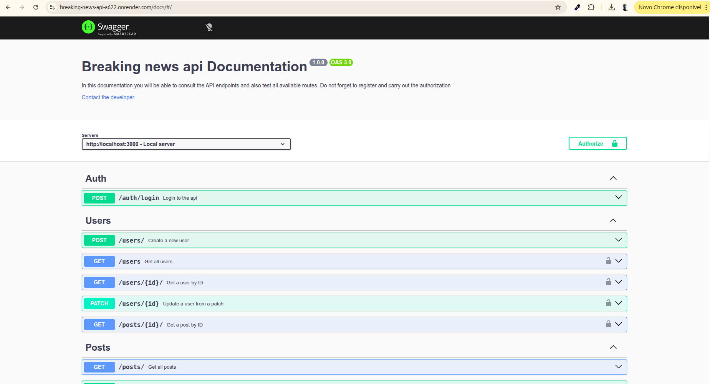

# 📰 Breaking News API

> A RESTful API for a news platform built with **Node.js**, **Express** and **MongoDB Atlas** — featuring JWT authentication, pagination, likes, comments and full Swagger documentation.

---



---

## 🚀 Tech Stack

| Technology | Description |
|---|---|
| **Node.js** | JavaScript runtime |
| **Express** | Web framework |
| **MongoDB Atlas** | Cloud database |
| **Mongoose** | ODM for MongoDB |
| **JWT** | Authentication |
| **Swagger / OpenAPI 3.0** | API Documentation |

---

## ✨ Features

### 👤 Users
- Register a new user
- List all users
- Get user by ID
- Update user profile

### 🔐 Authentication
- Login with email and password
- JWT-protected routes
- Bearer token authorization

### 📝 Posts
- Create a new post
- List all posts with **pagination** (offset & limit)
- Search posts by **title**
- List posts by **username**
- Update a post
- Delete a post
- **Like / Dislike** a post
- Add a **comment** to a post
- Remove a **comment** from a post

### 📖 Documentation
- Full interactive Swagger UI at `/docs`
- All endpoints documented with request/response schemas and examples

---

## 📡 Base URL

```
https://breaking-news-api-a622.onrender.com
```

---

## 🔑 Authentication

Protected routes require a Bearer token in the `Authorization` header:

```http
Authorization: Bearer <your_token>
```

Obtain your token by calling `POST /auth/login` with your credentials.

---

## 📄 API Documentation

Access the full interactive Swagger documentation at:

👉 **[https://breaking-news-api-a622.onrender.com/docs](https://breaking-news-api-a622.onrender.com/docs/#/)**

---

## 🛠️ Running Locally

```bash
# Clone the repository
git clone https://github.com/katalekoweb/breaking-news-api-node-express.git

# Install dependencies
npm install

# Configure environment variables
cp .env.example .env

# Start the server
npm run dev
```

> The server runs on `http://localhost:3000` by default.

---

## 🌍 Live API

The API is deployed on **Render**:

🔗 **[https://breaking-news-api-a622.onrender.com/docs/#/](https://breaking-news-api-a622.onrender.com/docs/#/)**

---

<p align="center">Made with ❤️ using Node.js & Express</p>